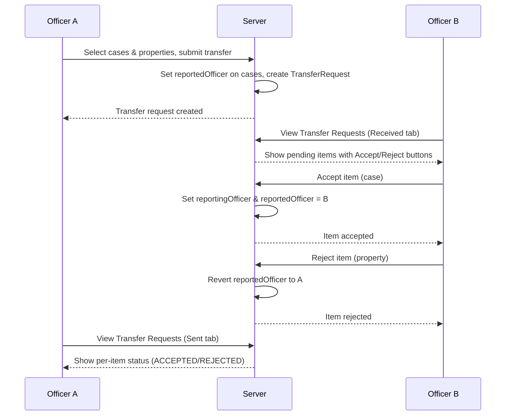

# Transfer Property Feature — Walkthrough

## Summary
Implemented officer-to-officer property & case transfer with accept/reject workflow. Officers (not admin) can select cases & unclaimed properties to transfer to another officer. The receiving officer can accept or reject each item individually. The sending officer can see the status of each item.

## Files Changed

### New Files
| File | Purpose |
|------|---------|
| [TransferRequest.ts](file:///e:/codes/e-malkhana-jharkhand/models/TransferRequest.ts) | Model for transfer requests with per-item status tracking |
| [accept/route.ts](file:///e:/codes/e-malkhana-jharkhand/app/api/trasferProperty/accept/route.ts) | PATCH API for accept/reject individual items |
| [officers/route.ts](file:///e:/codes/e-malkhana-jharkhand/app/api/officers/route.ts) | GET API to list active officers for dropdown |

### Modified Files
| File | Change |
|------|--------|
| [Case.ts](file:///e:/codes/e-malkhana-jharkhand/models/Case.ts) | Added `reportedOfficer` field |
| [trasferProperty/route.ts](file:///e:/codes/e-malkhana-jharkhand/app/api/trasferProperty/route.ts) | POST (create transfer) + GET (list transfers) |
| [transferProperty/page.tsx](file:///e:/codes/e-malkhana-jharkhand/app/transferProperty/page.tsx) | Send-side UI with checkboxes for cases & properties |
| [transferPropertyLog/page.tsx](file:///e:/codes/e-malkhana-jharkhand/app/transferPropertyLog/page.tsx) | Receive-side UI with Received/Sent tabs |
| [dashboard/page.tsx](file:///e:/codes/e-malkhana-jharkhand/app/dashboard/page.tsx) | Added Transfer Property & Transfer Requests buttons (officer-only), pending badge, updated case filter |
| [cases/route.ts](file:///e:/codes/e-malkhana-jharkhand/app/api/cases/route.ts) | Updated case visibility to include `reportedOfficer` |

## Transfer Flow

## Verification
- ✅ **Build**: `next build` completed successfully (exit code 0)
- ✅ **Existing functionality preserved**: Only additive changes — new fields have defaults, new routes are independent, case visibility expanded (not narrowed)
- ✅ **Officer A can see results**: Sent tab in Transfer Property Log shows per-item ACCEPTED/REJECTED status
